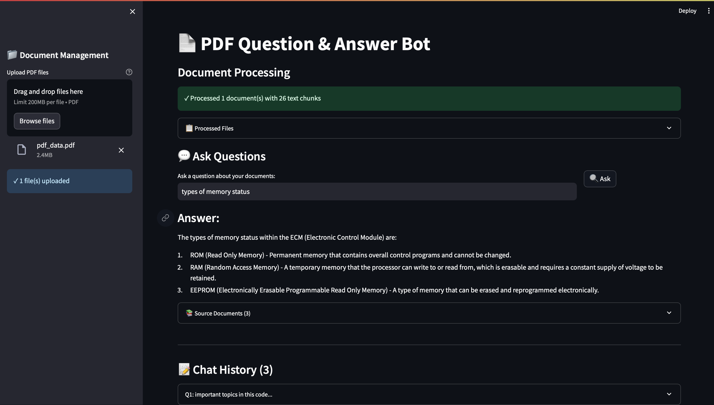

# 📄 PDF Question & Answer Bot

An AI-powered application that allows users to upload PDF documents and ask questions in natural language. The system retrieves relevant information using vector search and generates accurate answers using OpenAI models.

---

## 🖥️ Application UI



---

## 🚀 Features

- 📂 Upload PDF documents  
- ❓ Ask questions in natural language  
- 🧠 AI-generated answers using GPT-4o-mini  
- 🔍 Semantic search using FAISS vector database  
- 📑 Displays source document references  
- 💬 Chat history within session  
- ⚡ Rate limiting and file validation  
- 🔁 Automatic retry logic for API calls  

---

## 🛠️ Tech Stack

| Component        | Technology Used |
|----------------|---------------|
| Language        | Python 3.8+ |
| LLM Framework   | LangChain |
| AI Model        | OpenAI GPT-4o-mini |
| Vector Database | FAISS |
| UI              | Streamlit |
| Embeddings      | OpenAI Embeddings |

---

## Setup

1. Clone and navigate to the project:
```bash
cd Text-summarization
```

2. Create a virtual environment:
```bash
python -m venv venv
source venv/bin/activate  # Windows: venv\Scripts\activate
```

3. Install dependencies:
```bash
pip install -r requirements.txt
```

4. Create `.env` file with your OpenAI API key:
```
OPENAI_API_KEY= your-key-here
```

Get your key at https://platform.openai.com/api-keys

5. Run the app:
```bash
streamlit run pdf_bot.py
```

Open `http://localhost:8501` in your browser.

## Usage

1. Upload PDFs in the sidebar
2. Ask questions about your documents
3. View answers with source references
4. Chat history persists during your session

## Limits

- 20 questions per hour
- 50MB max file size
- PDF files only

## License

MIT
